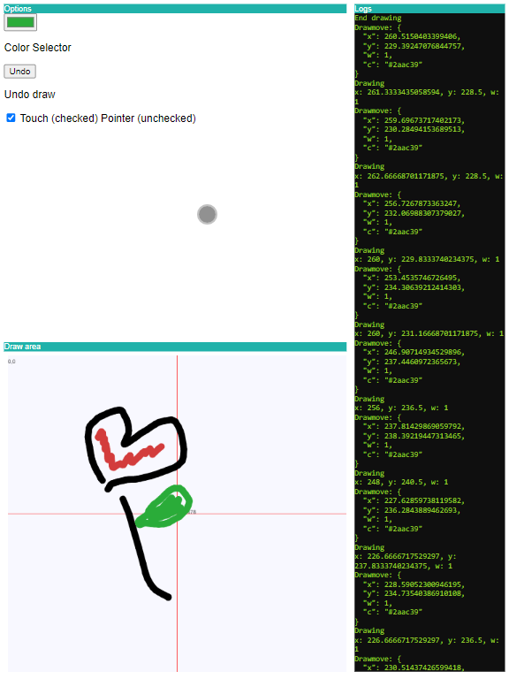

[](https://badge.fury.io/gh/csegura%2Fdrawall) [](https://github.com/csegura/drawall/releases/latest) [](https://badge.fury.io/js/drawall) [](https://opensource.org/licenses/MIT) [](https://github.com/csegura/drawall/issues?q=is%3Aissue+is%3Aopen+label%3A%22help+wanted%22)

# DraWall

> Draw over canvas with touch or pointer events

Designed to offer a unified and consistent user experience across various devices, ensuring smooth and responsive painting interactions for users.

This library bridges the gap between Android and iOS by seamlessly integrating touch and pointer events. Users on both platforms can enjoy a consistent and reliable painting experience. In my own Touch events are notoriously finicky on Android devices, often leading to inconsistent behavior, but Pointer events works fine, on iOS is just the opposite.

### Motivation

A simple drawing lib for use in my remotepad app

### Use

See demo.js

### From CDN

https://cdn.jsdelivr.net/npm/drawall@1.0.0/drawall.min.js

### Features

- Simple interface - regardless of the underlying event type (touch or pointer), the library presents a unified interface for handling painting interactions. drawstart, drawmove,  drawend
- Smooth painting 

#### Event details 

``` json
{
    x: 0,   // coords
    y: 0, 
    l: 1,   // lineWidth - pressure
    c: #000 // color 
}
```



